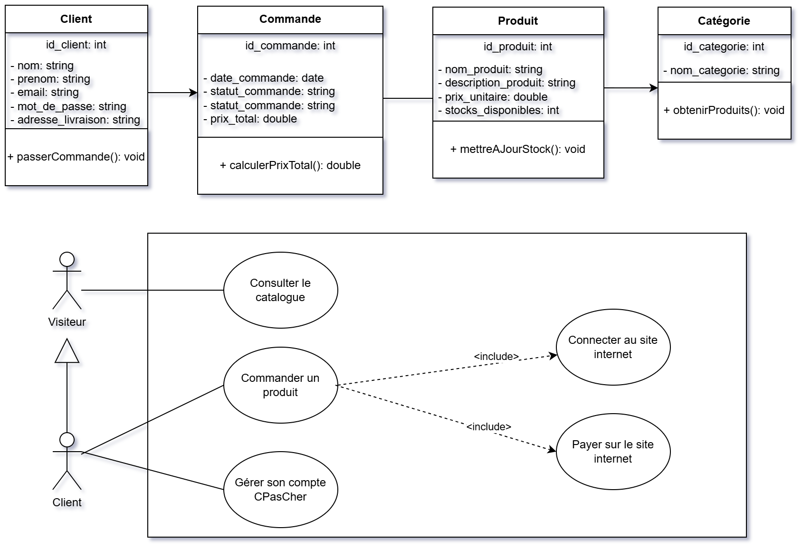

# CPasCher - Plateforme E-Commerce Complète

**CPasCher** est une plateforme de e-commerce moderne et responsive développée dans le cadre du cursus en **BTS SIO option SLAM** (1ère année). Le nom du site est un clin d'œil à "CDiscount en beaucoup moins cher".

Le site intègre une architecture orientée objet (POO), des formulaires dynamiques validés en PHP, un panier persistant avec localStorage, une base de données MySQL relationnelle, et une interface utilisateur haut de gamme (Aesthetics Premium).

---

## 🎨 Vue d'ensemble des Améliorations Récentes

* **Orienté Objet (POO) :** Ajout d'une couche métier avec la classe `Client` et refonte complète des scripts de traitement (`connexion`, `inscription`, `commande`) pour encapsuler la logique métier et sécuriser les interactions de données.
* **Design Premium & Fluide :** Modernisation de la charte graphique avec une palette de couleurs soignée (Indigo, Slate, Crimson Rose d'accentuation), une barre de navigation translucide (effet *glassmorphism*), une disposition en grille Bento, et l'intégration de photographies professionnelles HD réelles (via le CDN Unsplash).
* **Conception & Modélisation :** Intégration complète des diagrammes UML (Classes) et de Cas d'Utilisation (Use Cases).

---

## Modélisation et Diagrammes

Les diagrammes ont été modélisés et exportés depuis le site **draw.io / diagrams.net**.

* Fichier source du diagramme : [diagrams UML et UseCase.txt](ressources/diagrams%20UML%20et%20UseCase.txt)
* Lien pour modifier le diagramme en ligne : [Ouvrir sur diagrams.net](https://app.diagrams.net/#W7aef92152ce0ab73%2F7AEF92152CE0AB73!s021d2554fc4845a2a98732d19500c6e3#%7B%22pageId%22%3A%224UJ4FgyOddXflWFHxV7d%22%7D)

### Aperçu des Diagrammes (UML + Use Case)

Le visuel ci-dessous présente :

- **En haut** : le diagramme de classes UML (entités `Client`, `Commande`, `Produit`, `Catégorie` et leurs relations).
- **En bas** : le diagramme de cas d'utilisation (acteurs `Visiteur` et `Client`, et leurs interactions avec le système).



---

## Technologies Utilisées

### Frontend

* **HTML5 / CSS3 :** Intégration moderne et premium (variables CSS, Bento Grid pour les promos, flou de fond translucide *backdrop-filter*, animations de transition et effets de zoom sur les cartes).
* **Vanilla JavaScript :** Gestion dynamique du panier local (`localStorage`), mise à jour des compteurs/badges, gestion de l'affichage adaptatif de l'état utilisateur dans la barre de navigation et animation des accordéons de la FAQ.

### Backend & Persistance

* **PHP 8 (Orienté Objet) :** Architecture MVC simplifiée avec séparation claire entre les contrôleurs de traitement et la logique métier (`website/PHP/OO/Client.php`).
* **MySQL / PDO :** Base de données relationnelle interrogée de manière sécurisée via des requêtes préparées avec typage des paramètres pour prévenir toute injection SQL.

---

## 📂 Structure du Projet

```text
Site-ECommerce-CPascher/
├── .agents/                   # Compétences et configurations des agents IA
├── .vscode/                   # Configuration du projet pour VS Code
├── AGENTS.md                  # Directives pour les agents IA du projet
├── ressources/                # Ressources de modélisation et base de données
│   ├── diagrams UML et UseCase.txt   # Source Draw.io des diagrammes UML et Cas d'Utilisation
│   ├── Diagramme-MLD.md       # Descriptif textuel du Modèle Logique de Données
│   ├── LoopingImage-MCD.png   # Image du Modèle Conceptuel de Données (issu de Looping)
│   └── Site-ECommerce-CPascher.sql   # Script d'initialisation de la base de données
├── website/                   # Dossier contenant le site internet
│   ├── CSS/                   # Feuilles de styles structurées
│   │   ├── style.css          # Variables globales, Navbar, Footer et composants communs
│   │   ├── accueil.css        # Styles propres au layout de la page d'accueil (Hero, Bento Grid)
│   │   ├── categorie.css      # Styles des fiches de catégorie
│   │   └── produit.css        # Styles pour l'affichage de détail produit
│   ├── HTML/                  # Pages statiques du site
│   │   ├── a-propos.html      # Présentation de l'entreprise
│   │   ├── categorie.html     # Liste des articles par catégorie
│   │   ├── commande.html      # Formulaire de commande et paiement
│   │   ├── confirmation.html  # Remerciements et confirmation
│   │   ├── connexion.html     # Authentification du client
│   │   ├── contact.html       # Formulaire de support client
│   │   ├── conditions-generales.html # CGV / CGU du site
│   │   ├── faq.html           # Questions fréquentes avec accordéons dynamiques
│   │   ├── inscription.html   # Création de compte client
│   │   ├── mentions-legales.html # Mentions obligatoires RGPD
│   │   ├── mon-compte.html    # Profil et historique des commandes du client
│   │   ├── panier.html        # Gestion du panier
│   │   └── produit.html       # Fiche produit détaillée
│   ├── JAVASCRIPT/            # Scripts dynamiques
│   │   └── script.js          # Gestion interactive globale (panier, animations UI)
│   └── PHP/                   # Logique backend et accès aux données
│       ├── config.php         # Initialisation de la connexion PDO
│       ├── traiter-connexion.php    # Contrôleur d'authentification
│       ├── traiter-inscription.php  # Contrôleur de création de compte
│       ├── traiter-commande.php     # Contrôleur d'enregistrement de commande
│       └── OO/                # Logique métier en orienté objet
│           └── Client.php     # Classe métier Client (attributs & méthodes de commande)
└── README.md                  # Documentation globale du projet (ce fichier)
```

---

## Liens Utiles

* Accéder à la **Base de Données *(.sql)*** du projet [**\[ICI\]**](https://github.com/PAUL-Projets-Ensitech/Site-ECommerce-CPascher/blob/main/ressources/Site-ECommerce-CPascher.sql)
* Accéder au diagramme **MCD** du projet [**\[ICI\]**](https://github.com/PAUL-Projets-Ensitech/Site-ECommerce-CPascher/blob/main/ressources/LoopingImage-MCD.png)
* Accéder au descriptif du diagramme **MLD** du projet [**\[ICI\]**](https://github.com/PAUL-Projets-Ensitech/Site-ECommerce-CPascher/blob/main/ressources/Diagramme-MLD.md)

---

## Configuration Locale

1. **Serveur web local :** Installez et lancez Apache/MySQL via **XAMPP** ou **WampServer**.
2. **Base de données :** Importez le fichier `ressources/Site-ECommerce-CPascher.sql` dans votre serveur local (ex: via phpMyAdmin).
3. **Fichier config :** Vérifiez les accès dans `website/PHP/config.php` (hôte, utilisateur, mot de passe).
4. **Accès :** Placez le projet dans `htdocs` ou `www` et naviguez vers : `http://localhost/Site-ECommerce-CPascher/website/index.html`.

---

> *© 2026 CPasCher - Projet d'examen BTS SIO option SLAM - Paul.*
